# Multilingual Audio Generation System (Current Architecture)

## Overview
This document describes the current system for generating NotebookLM audio content in multiple languages for the 37degrees project. The system uses a unified `book.yaml` file containing AFA analysis and format selection, with language-specific prompt generation.

## Core Concept

- **Single source of truth**: One `book.yaml` per book with complete AFA analysis
- **8 dialogue formats**: From exploratory_dialogue to academic_analysis
- **9 supported audio languages**: Through NotebookLM's language selector
- **Host names pattern**: Male & Female names per language
- **Format selection**: Currently algorithmic (v2.0), moving toward AI-based selection

## Supported Languages with Host Names

1. **Polski** - Andrzej & Beata (uses Polish AFA with full local context)
2. **English** - Andrew & Beth (uses English AFA)
3. **Español** - Andrés & Beatriz (uses English AFA)
4. **Português** - André & Beatriz (uses English AFA)
5. **हिन्दी** - Arjun (अर्जुन) & Bhavna (भावना) (uses English AFA)
6. **日本語** - Akira (明) & Beniko (紅子) (uses English AFA)
7. **한국어** - Ahn (안) & Bora (보라) (uses English AFA)
8. **Deutsch** - Andreas & Brigitte (uses English AFA)
9. **Français** - Antoine & Béatrice (uses English AFA)

## System Architecture

### 1. Book Configuration
- **File**: `books/NNNN_bookname/book.yaml`
- **Content**: Complete AFA analysis including scores, themes, format selection, and prompts
- **Structure**:
  ```yaml
  book_info:
    title, author, year, genre
  afa_analysis:
    scores: (8 behavioral dimensions)
    composite_scores: (DEPTH and HEAT)
    themes: (universal and localized)
    formats: (selected format with prompts)
  ```

### 2. Dialogue Formats (8 types)
- **exploratory_dialogue**: Enthusiast with newcomer discovering together
- **academic_analysis**: Professor with student analyzing complexities
- **cultural_dimension**: Local specialist with global observer
- **social_perspective**: Social historian with contemporary critic
- **critical_debate**: Advocate defending vs skeptic questioning
- **narrative_reconstruction**: Investigator with witness reconstructing
- **temporal_context**: Classical expert with modern reader
- **emotional_perspective**: Emotional reader with analytical critic

### 3. Format Selection System
- **Current (v2.0)**: Algorithmic with frequency balancing (`afa_calculations.py`)
- **Future**: AI-based selection using book context and research materials

### 4. Generation Flow

```mermaid
graph TD
    A[Book Research Files] --> B[AFA Analysis Agent]
    B --> C[book.yaml with scores & themes]
    C --> D[Format Selection Algorithm/AI]
    D --> E[Selected Format + Prompts]
    E --> F[Language-specific Generation]
    F --> G[Polish - Andrzej/Beata]
    F --> H[English - Andrew/Beth]
    F --> I[Spanish - Andrés/Beatriz]
    F --> J[Portuguese - André/Beatriz]
    F --> K[Hindi - Arjun/Bhavna]
    F --> L[Japanese - Akira/Beniko]
    F --> M[Korean - Ahn/Bora]
    F --> N[German - Andreas/Brigitte]
    F --> O[French - Antoine/Béatrice]
```



## Host Name Mapping

### English
- Male: Andrew
- Female: Beth

### Polish
- Male: Andrzej
- Female: Beata

### Spanish
- Male: Andrés
- Female: Beatriz

### Portuguese
- Male: André
- Female: Beatriz

### Hindi
- Male: अर्जुन (Arjun)
- Female: भावना (Bhavna)

### Japanese
- Male: 明 (Akira)
- Female: 紅子 (Beniko)

### Korean
- Male: 안 (Ahn)
- Female: 보라 (Bora)

### German
- Male: Andreas
- Female: Brigitte

### French
- Male: Antoine
- Female: Béatrice

## Content Strategy

### Universal Content (Generated Once in English)
- Book analysis scores (A-I criteria)
- Format selection based on rotation algorithm
- Key threads and insights from research
- Duration calculations
- Structural mapping

### Localized Content (Translated/Adapted)
- Host names and gender instructions
- Format names and descriptions
- Prompt instructions for AI hosts
- Introduction phrases
- Closing statements

### Excluded from International Versions
- Polish educational context (matura questions)
- Local school curricula references
- Country-specific translation history
- Regional cultural adaptations
- Local publisher information

## File Structure (Current)

```
books/NNNN_book_name/
├── book.yaml                       # Complete AFA analysis and format selection
├── docs/
│   └── findings/                   # Research files from agents
│       ├── au-research_culture_impact.md
│       ├── au-research_dark_drama.md
│       ├── au-research_facts_history.md
│       ├── au-research_local_[lang]_context.md  # Multiple language contexts
│       ├── au-research_reality_wisdom.md
│       ├── au-research_symbols_meanings.md
│       ├── au-research_writing_innovation.md
│       └── au-research_youth_digital.md
└── prompts/                        # Generated scene prompts (if applicable)
```

## NotebookLM Language Codes

These are the exact codes to use in the NotebookLM interface:

| Language | NotebookLM Code | Notes |
|----------|----------------|-------|
| English | `English` | Default language |
| Polish | `polski` | Original project language |
| Spanish | `español (Latinoamérica)` | Most universal Spanish variant |
| Portuguese | `português (Brasil)` | Larger audience than Portugal variant |
| Hindi | `हिन्दी` | Uses Devanagari script |
| Japanese | `日本語` | Uses native script |
| Korean | `한국어` | Uses Hangul script |
| German | `Deutsch` | Standard German |
| French | `français` | European French (more standard than Canadian) |

## Dialogue Format Names (8 formats)

### Current System Formats

1. **exploratory_dialogue**
   - PL: Odkrywcza rozmowa
   - EN: Exploratory Dialogue
   - ES: Diálogo Exploratorio
   - PT: Diálogo Exploratório
   - HI: खोजपूर्ण संवाद
   - JA: 探索的対話
   - KO: 탐색적 대화
   - DE: Erkundungsdialog
   - FR: Dialogue Exploratoire

2. **academic_analysis**
   - PL: Analiza akademicka
   - EN: Academic Analysis
   - ES: Análisis Académico
   - PT: Análise Acadêmica
   - HI: शैक्षणिक विश्लेषण
   - JA: 学術的分析
   - KO: 학술적 분석
   - DE: Akademische Analyse
   - FR: Analyse Académique

3. **critical_debate**
   - PL: Krytyczna debata
   - EN: Critical Debate
   - ES: Debate Crítico
   - PT: Debate Crítico
   - HI: आलोचनात्मक बहस
   - JA: 批判的討論
   - KO: 비판적 토론
   - DE: Kritische Debatte
   - FR: Débat Critique

## Format-Specific Role System

Each of the 8 dialogue formats has unique host personalities and roles:

### Example: "exploratory_dialogue"
- **Polish**: Andrzej (entuzjastyczny odkrywca) + Beata (ciekawska towarzyszka)
- **English**: Andrew (enthusiastic explorer) + Beth (curious companion)
- **Spanish**: Andrés (explorador entusiasta) + Beatriz (compañera curiosa)

### Role Assignment Pattern for All 8 Formats:
1. **exploratory_dialogue**: Explorer + Curious newcomer
2. **academic_analysis**: Professor + Student assistant
3. **cultural_dimension**: Local expert + Global observer
4. **social_perspective**: Social historian + Contemporary critic
5. **critical_debate**: Advocate + Skeptic
6. **narrative_reconstruction**: Investigator + Witness
7. **temporal_context**: Classical expert + Modern reader
8. **emotional_perspective**: Emotional reader + Analytical critic

### Host Dynamics:
- **Host A (Male with A-name)**: Usually takes the expert/leading role
- **Host B (Female with B-name)**: Often takes the questioning/discovering role
- **Balance**: Both hosts contribute equally but from different perspectives

## Workflow

### Current Process:
1. Research agents generate findings in `docs/findings/`
2. AFA analysis agent processes findings and creates `book.yaml`
3. Format selection algorithm (v2.0) chooses dialogue format
4. Language-specific prompts generated with A/B host names
5. NotebookLM generates audio in selected language

### For Each Language:
- **Polish**: Andrzej & Beata with full local context
- **English**: Andrew & Beth with universal themes
- **Spanish**: Andrés & Beatriz
- **Portuguese**: André & Beatriz
- **Hindi**: Arjun & Bhavna
- **Japanese**: Akira & Beniko
- **Korean**: Ahn & Bora
- **German**: Andreas & Brigitte
- **French**: Antoine & Béatrice

## Implementation Status

### ✅ Completed:
1. Single `book.yaml` architecture with complete AFA analysis
2. 8 dialogue formats defined with host roles
3. Format selection algorithm v2.0 with adaptive balancing
4. A/B naming pattern for all 9 languages

### 🚧 In Progress:
1. Moving from algorithmic to AI-based format selection
2. Guidelines for AI selector (AFA_FORMAT_SELECTION_GUIDELINES.md)
3. System prompt for AI selector (AFA_AI_SELECTOR_PROMPT.md)

### 📝 To Do:
1. Implement AI-based format selector
2. Test format selection with existing books
3. Generate audio for all 9 languages
4. Create batch processing scripts

## Quality Assurance

### Content Review Checklist
- [ ] No local educational references in international versions
- [ ] Host names are culturally appropriate
- [ ] Format names make sense in target language
- [ ] Gender instructions are clear
- [ ] Prompts are grammatically correct
- [ ] Universal themes are emphasized

### Technical Validation
- [ ] NotebookLM language codes are correct
- [ ] File naming follows convention
- [ ] All 9 language versions generated
- [ ] Character encoding is UTF-8
- [ ] YAML structure is valid
- [ ] Audio language matches filename code (use `check_lang.py`)

## Audio Language Verification

### Overview
The `scripts/check_lang.py` tool verifies that audio files contain the language indicated by their filename. This helps detect mismatches between the expected language code in the filename and the actual spoken language in the audio.

### File Naming Convention
Audio files must follow this pattern:
```
NNNN_bookname_LANG.[m4a|mp4]
```
Where `LANG` is a two-letter ISO-639-1 language code matching the supported languages:
- `pl` - Polski
- `en` - English
- `es` - Español
- `pt` - Português
- `hi` - हिन्दी
- `ja` - 日本語
- `ko` - 한국어
- `de` - Deutsch
- `fr` - Français

### Usage

**Basic verification** (shows only mismatches):
```bash
python scripts/check_lang.py --folder books/NNNN_bookname/audio --model turbo
```

**With debug information**:
```bash
python scripts/check_lang.py --folder books/NNNN_bookname/audio --model turbo --debug
```

**With transcription** (creates .txt/.vtt/.srt files):
```bash
python scripts/check_lang.py --folder books/NNNN_bookname/audio --model turbo --transcription --format srt
```

### Output Format

**When mismatch detected**:
```
books/0100_book/audio/0100_book_pl.m4a	expected=pl	detected=en
```

For each mismatch, the script also creates a `.err` file in the same directory:
```
books/0100_book/audio/0100_book_pl.err
```
Content: Same as console output line

**When all files match**: No output (silent success)

### Model Selection
Available Whisper models (accuracy vs speed):
- `tiny` - Fastest, least accurate
- `base` - Fast, basic accuracy
- `small` - Balanced
- `medium` - Good accuracy
- `large` - Best accuracy, slow
- `turbo` - Recommended (fast + accurate)

### Common Scenarios

**Verify all audio in a book folder**:
```bash
python scripts/check_lang.py --folder books/0100_bookname/audio --model turbo
```

**Check with GPU acceleration**:
```bash
python scripts/check_lang.py --folder books/0100_bookname/audio --model turbo --device cuda
```

**Generate transcriptions for all files**:
```bash
python scripts/check_lang.py --folder books/0100_bookname/audio --model turbo --transcription --format all
```

### Integration with Workflow

1. **After NotebookLM download**: Run verification to ensure files weren't mislabeled
2. **Before publishing**: Final check that all language codes are correct
3. **Batch verification**: Check entire audio collection periodically
4. **Error handling**: Review `.err` files to identify systematic issues

### Troubleshooting

**No CUDA available**: Script auto-falls back to CPU
```bash
python scripts/check_lang.py --folder path/to/audio --model turbo --device cpu
```

**Slow processing**: Use smaller model or limit threads
```bash
python scripts/check_lang.py --folder path/to/audio --model base --threads 4
```

**False positives**: Some mixed-language content may trigger mismatches - review manually

## Prompt Templates (Examples)

### English Template (academic_analysis format)
```
Host A = Andrew (male). Speak in first person.
"You are Professor Andrew, analyzing '{book_title}' with scholarly depth. Discuss structure, symbolism, literary techniques. Academic but accessible."

Host B = Beth (female). Speak in first person.
"You are Beth, a graduate student. Ask for clarification, request examples, connect to literary theories, ensure accessibility."
```

### Spanish Template (exploratory_dialogue format)
```
Host A = Andrés (hombre). Habla en primera persona.
"Eres Andrés, un explorador entusiasta descubriendo '{book_title}'. Comparte tu pasión y conocimiento de manera accesible."

Host B = Beatriz (mujer). Habla en primera persona.
"Eres Beatriz, curiosa sobre '{book_title}' por primera vez. Haz preguntas básicas, expresa primeras impresiones."
```

## Notes and Considerations

### Cultural Sensitivity
- Host names chosen to be common but not stereotypical
- Format descriptions adapted to cultural communication styles
- Avoided idioms that don't translate well

### Technical Limitations
- NotebookLM may have varying quality across languages
- Some languages may require longer processing times
- Character limits may vary by script type

### Future Enhancements
- Additional languages based on demand
- Regional variants (e.g., European Spanish)
- Custom host personalities per culture
- Automated translation pipeline

## Support and Maintenance

### Adding New Languages
1. Check NotebookLM language availability
2. Add to `audio_languages.yaml`
3. Create format translations
4. Select appropriate host names
5. Test generation quality

### Updating Existing Languages
1. Update configuration files
2. Regenerate affected books
3. Validate output quality
4. Update documentation

---

*Last Updated: 2025-01-15*
*Version: 2.0* - Updated to reflect current single book.yaml architecture with 8 dialogue formats