# Multilingual Audio Generation System (Current Architecture)

## Overview
This document describes the current system for generating NotebookLM audio content in multiple languages for the 37degrees project. The system uses a unified `book.yaml` file containing AFA analysis and format selection, with language-specific prompt generation.

## Core Concept

- **Single source of truth**: One `book.yaml` per book with complete AFA analysis
- **8 dialogue formats**: From exploratory_dialogue to academic_analysis
- **9 supported audio languages**: Through NotebookLM's language selector
- **Host names pattern**: Male & Female names per language
- **Format selection**: Currently algorithmic (v2.0), moving toward AI-based selection

## Supported Languages with Host Names

1. **Polski** - Andrzej & Beata (uses Polish AFA with full local context)
2. **English** - Andrew & Beth (uses English AFA)
3. **Español** - Andrés & Beatriz (uses English AFA)
4. **Português** - André & Beatriz (uses English AFA)
5. **हिन्दी** - Arjun (अर्जुन) & Bhavna (भावना) (uses English AFA)
6. **日本語** - Akira (明) & Beniko (紅子) (uses English AFA)
7. **한국어** - Ahn (안) & Bora (보라) (uses English AFA)
8. **Deutsch** - Andreas & Brigitte (uses English AFA)
9. **Français** - Antoine & Béatrice (uses English AFA)

## System Architecture

### 1. Book Configuration
- **File**: `books/NNNN_bookname/book.yaml`
- **Content**: Complete AFA analysis including scores, themes, format selection, and prompts
- **Structure**:
  ```yaml
  book_info:
    title, author, year, genre
  afa_analysis:
    scores: (8 behavioral dimensions)
    composite_scores: (DEPTH and HEAT)
    themes: (universal and localized)
    formats: (selected format with prompts)
  ```

### 2. Dialogue Formats (8 types)
- **exploratory_dialogue**: Enthusiast with newcomer discovering together
- **academic_analysis**: Professor with student analyzing complexities
- **cultural_dimension**: Local specialist with global observer
- **social_perspective**: Social historian with contemporary critic
- **critical_debate**: Advocate defending vs skeptic questioning
- **narrative_reconstruction**: Investigator with witness reconstructing
- **temporal_context**: Classical expert with modern reader
- **emotional_perspective**: Emotional reader with analytical critic

### 3. Format Selection System
- **Current (v2.0)**: Algorithmic with frequency balancing (`afa_calculations.py`)
- **Future**: AI-based selection using book context and research materials

### 4. Generation Flow

```mermaid
graph TD
    A[Book Research Files] --> B[AFA Analysis Agent]
    B --> C[book.yaml with scores & themes]
    C --> D[Format Selection Algorithm/AI]
    D --> E[Selected Format + Prompts]
    E --> F[Language-specific Generation]
    F --> G[Polish - Andrzej/Beata]
    F --> H[English - Andrew/Beth]
    F --> I[Spanish - Andrés/Beatriz]
    F --> J[Portuguese - André/Beatriz]
    F --> K[Hindi - Arjun/Bhavna]
    F --> L[Japanese - Akira/Beniko]
    F --> M[Korean - Ahn/Bora]
    F --> N[German - Andreas/Brigitte]
    F --> O[French - Antoine/Béatrice]
```



## Host Name Mapping

### English
- Male: Andrew
- Female: Beth

### Polish
- Male: Andrzej
- Female: Beata

### Spanish
- Male: Andrés
- Female: Beatriz

### Portuguese
- Male: André
- Female: Beatriz

### Hindi
- Male: अर्जुन (Arjun)
- Female: भावना (Bhavna)

### Japanese
- Male: 明 (Akira)
- Female: 紅子 (Beniko)

### Korean
- Male: 안 (Ahn)
- Female: 보라 (Bora)

### German
- Male: Andreas
- Female: Brigitte

### French
- Male: Antoine
- Female: Béatrice

## Content Strategy

### Universal Content (Generated Once in English)
- Book analysis scores (A-I criteria)
- Format selection based on rotation algorithm
- Key threads and insights from research
- Duration calculations
- Structural mapping

### Localized Content (Translated/Adapted)
- Host names and gender instructions
- Format names and descriptions
- Prompt instructions for AI hosts
- Introduction phrases
- Closing statements

### Excluded from International Versions
- Polish educational context (matura questions)
- Local school curricula references
- Country-specific translation history
- Regional cultural adaptations
- Local publisher information

## File Structure (Current)

```
books/NNNN_book_name/
├── book.yaml                       # Complete AFA analysis and format selection
├── docs/
│   └── findings/                   # Research files from agents
│       ├── au-research_culture_impact.md
│       ├── au-research_dark_drama.md
│       ├── au-research_facts_history.md
│       ├── au-research_local_[lang]_context.md  # Multiple language contexts
│       ├── au-research_reality_wisdom.md
│       ├── au-research_symbols_meanings.md
│       ├── au-research_writing_innovation.md
│       └── au-research_youth_digital.md
└── prompts/                        # Generated scene prompts (if applicable)
```

## NotebookLM Language Codes

These are the exact codes to use in the NotebookLM interface:

| Language | NotebookLM Code | Notes |
|----------|----------------|-------|
| English | `English` | Default language |
| Polish | `polski` | Original project language |
| Spanish | `español (Latinoamérica)` | Most universal Spanish variant |
| Portuguese | `português (Brasil)` | Larger audience than Portugal variant |
| Hindi | `हिन्दी` | Uses Devanagari script |
| Japanese | `日本語` | Uses native script |
| Korean | `한국어` | Uses Hangul script |
| German | `Deutsch` | Standard German |
| French | `français` | European French (more standard than Canadian) |

## Dialogue Format Names (8 formats)

### Current System Formats

1. **exploratory_dialogue**
   - PL: Odkrywcza rozmowa
   - EN: Exploratory Dialogue
   - ES: Diálogo Exploratorio
   - PT: Diálogo Exploratório
   - HI: खोजपूर्ण संवाद
   - JA: 探索的対話
   - KO: 탐색적 대화
   - DE: Erkundungsdialog
   - FR: Dialogue Exploratoire

2. **academic_analysis**
   - PL: Analiza akademicka
   - EN: Academic Analysis
   - ES: Análisis Académico
   - PT: Análise Acadêmica
   - HI: शैक्षणिक विश्लेषण
   - JA: 学術的分析
   - KO: 학술적 분석
   - DE: Akademische Analyse
   - FR: Analyse Académique

3. **critical_debate**
   - PL: Krytyczna debata
   - EN: Critical Debate
   - ES: Debate Crítico
   - PT: Debate Crítico
   - HI: आलोचनात्मक बहस
   - JA: 批判的討論
   - KO: 비판적 토론
   - DE: Kritische Debatte
   - FR: Débat Critique

## Format-Specific Role System

Each of the 8 dialogue formats has unique host personalities and roles:

### Example: "exploratory_dialogue"
- **Polish**: Andrzej (entuzjastyczny odkrywca) + Beata (ciekawska towarzyszka)
- **English**: Andrew (enthusiastic explorer) + Beth (curious companion)
- **Spanish**: Andrés (explorador entusiasta) + Beatriz (compañera curiosa)

### Role Assignment Pattern for All 8 Formats:
1. **exploratory_dialogue**: Explorer + Curious newcomer
2. **academic_analysis**: Professor + Student assistant
3. **cultural_dimension**: Local expert + Global observer
4. **social_perspective**: Social historian + Contemporary critic
5. **critical_debate**: Advocate + Skeptic
6. **narrative_reconstruction**: Investigator + Witness
7. **temporal_context**: Classical expert + Modern reader
8. **emotional_perspective**: Emotional reader + Analytical critic

### Host Dynamics:
- **Host A (Male with A-name)**: Usually takes the expert/leading role
- **Host B (Female with B-name)**: Often takes the questioning/discovering role
- **Balance**: Both hosts contribute equally but from different perspectives

## Workflow

### Current Process:
1. Research agents generate findings in `docs/findings/`
2. AFA analysis agent processes findings and creates `book.yaml`
3. Format selection algorithm (v2.0) chooses dialogue format
4. Language-specific prompts generated with A/B host names
5. NotebookLM generates audio in selected language

### For Each Language:
- **Polish**: Andrzej & Beata with full local context
- **English**: Andrew & Beth with universal themes
- **Spanish**: Andrés & Beatriz
- **Portuguese**: André & Beatriz
- **Hindi**: Arjun & Bhavna
- **Japanese**: Akira & Beniko
- **Korean**: Ahn & Bora
- **German**: Andreas & Brigitte
- **French**: Antoine & Béatrice

## Implementation Status

### ✅ Completed:
1. Single `book.yaml` architecture with complete AFA analysis
2. 8 dialogue formats defined with host roles
3. Format selection algorithm v2.0 with adaptive balancing
4. A/B naming pattern for all 9 languages

### 🚧 In Progress:
1. Moving from algorithmic to AI-based format selection
2. Guidelines for AI selector (AFA_FORMAT_SELECTION_GUIDELINES.md)
3. System prompt for AI selector (AFA_AI_SELECTOR_PROMPT.md)

### 📝 To Do:
1. Implement AI-based format selector
2. Test format selection with existing books
3. Generate audio for all 9 languages
4. Create batch processing scripts

## Quality Assurance

### Content Review Checklist
- [ ] No local educational references in international versions
- [ ] Host names are culturally appropriate
- [ ] Format names make sense in target language
- [ ] Gender instructions are clear
- [ ] Prompts are grammatically correct
- [ ] Universal themes are emphasized

### Technical Validation
- [ ] NotebookLM language codes are correct
- [ ] File naming follows convention
- [ ] All 9 language versions generated
- [ ] Character encoding is UTF-8
- [ ] YAML structure is valid

## Prompt Templates (Examples)

### English Template (academic_analysis format)
```
Host A = Andrew (male). Speak in first person.
"You are Professor Andrew, analyzing '{book_title}' with scholarly depth. Discuss structure, symbolism, literary techniques. Academic but accessible."

Host B = Beth (female). Speak in first person.
"You are Beth, a graduate student. Ask for clarification, request examples, connect to literary theories, ensure accessibility."
```

### Spanish Template (exploratory_dialogue format)
```
Host A = Andrés (hombre). Habla en primera persona.
"Eres Andrés, un explorador entusiasta descubriendo '{book_title}'. Comparte tu pasión y conocimiento de manera accesible."

Host B = Beatriz (mujer). Habla en primera persona.
"Eres Beatriz, curiosa sobre '{book_title}' por primera vez. Haz preguntas básicas, expresa primeras impresiones."
```

## Notes and Considerations

### Cultural Sensitivity
- Host names chosen to be common but not stereotypical
- Format descriptions adapted to cultural communication styles
- Avoided idioms that don't translate well

### Technical Limitations
- NotebookLM may have varying quality across languages
- Some languages may require longer processing times
- Character limits may vary by script type

### Future Enhancements
- Additional languages based on demand
- Regional variants (e.g., European Spanish)
- Custom host personalities per culture
- Automated translation pipeline

## Support and Maintenance

### Adding New Languages
1. Check NotebookLM language availability
2. Add to `audio_languages.yaml`
3. Create format translations
4. Select appropriate host names
5. Test generation quality

### Updating Existing Languages
1. Update configuration files
2. Regenerate affected books
3. Validate output quality
4. Update documentation

---

*Last Updated: 2025-01-15*
*Version: 2.0* - Updated to reflect current single book.yaml architecture with 8 dialogue formats