# Multilingual Audio Generation System (Simplified)

## Overview
This document describes the simplified system for generating NotebookLM audio content in multiple languages for the 37degrees project. The system uses only 2 AFA versions (Polish and English) with NotebookLM's built-in translation capabilities handling the rest.

## Core Concept

- **2 AFA files only**: Polish (`-afa-pl.md`) and English (`-afa-en.md`)
- **9 supported audio languages**: Through NotebookLM's language selector
- **Host names pattern**: A & B names (Andrzej/Beata, Andrew/Beth, etc.)
- **Prompt language**: English base for universal AI translation

## Supported Languages with Host Names

1. **Polski** - Andrzej & Beata (uses Polish AFA with full local context)
2. **English** - Andrew & Beth (uses English AFA)
3. **Español** - Andrés & Beatriz (uses English AFA)
4. **Português** - André & Beatriz (uses English AFA)
5. **हिन्दी** - Arjun (अर्जुन) & Bhavna (भावना) (uses English AFA)
6. **日本語** - Akira (明) & Beniko (紅子) (uses English AFA)
7. **한국어** - Ahn (안) & Bora (보라) (uses English AFA)
8. **Deutsch** - Andreas & Brigitte (uses English AFA)
9. **Français** - Antoine & Béatrice (uses English AFA)

## System Architecture

### 1. Language Configuration
- **File**: `config/audio_languages.yaml`
- **Content**: Language codes, NotebookLM mappings, host names
- **Usage**: Central configuration for all language-specific settings

### 2. Format Role Definitions
- **File**: `config/audio_format_roles.yaml`
- **Content**: Specific personality roles and detailed instructions for each format in each language
- **Usage**: Defines how hosts behave for different dialogue formats (Friendly Exchange, Master & Student, etc.)

### 3. Format Translations
- **File**: `config/audio_format_translations.yaml`
- **Content**: Translated names for all 12 audio formats
- **Usage**: Ensures format names are culturally appropriate

### 4. Simplified Generation Flow

```mermaid
graph TD
    A[Book Research Files] --> B[Polish AFA with local context]
    A --> C[English AFA without local context]
    B --> D[Polish Audio - Andrzej/Beata]
    C --> E[NotebookLM Language Selection]
    E --> F[English - Andrew/Beth]
    E --> G[Spanish - Andrés/Beatriz]
    E --> H[Portuguese - André/Beatriz]
    E --> I[Hindi - Arjun/Bhavna]
    E --> J[Japanese - Akira/Beniko]
    E --> K[Korean - Ahn/Bora]
    E --> L[German - Andreas/Brigitte]
    E --> M[French - Antoine/Béatrice]
    D --> M[EN Version - Final]
```



## Host Name Mapping

### English
- Male: Andrew
- Female: Beth

### Polish
- Male: Michał
- Female: Kasia

### Spanish
- Male: Carlos
- Female: María

### Portuguese
- Male: João
- Female: Ana

### Hindi
- Male: राज (Raj)
- Female: प्रिया (Priya)

### Japanese
- Male: 健太 (Kenta)
- Female: 愛子 (Aiko)

### Korean
- Male: 민수 (Minsu)
- Female: 지은 (Jieun)

### German
- Male: Stefan
- Female: Julia

### French
- Male: Pierre
- Female: Sophie

## Content Strategy

### Universal Content (Generated Once in English)
- Book analysis scores (A-I criteria)
- Format selection based on rotation algorithm
- Key threads and insights from research
- Duration calculations
- Structural mapping

### Localized Content (Translated/Adapted)
- Host names and gender instructions
- Format names and descriptions
- Prompt instructions for AI hosts
- Introduction phrases
- Closing statements

### Excluded from International Versions
- Polish educational context (matura questions)
- Local school curricula references
- Country-specific translation history
- Regional cultural adaptations
- Local publisher information

## File Structure (Simplified)

```
books/NNNN_book_name/docs/
├── NNNN_book_name-afa-pl.md       # Polish version with full local context
├── NNNN_book_name-afa-en.md       # English version without local context
└── findings/                       # Research files used by both versions
    ├── au-research_local_context.md  # Used only in Polish version
    └── [other research files]        # Used in both versions
```

## NotebookLM Language Codes

These are the exact codes to use in the NotebookLM interface:

| Language | NotebookLM Code | Notes |
|----------|----------------|-------|
| English | `English` | Default language |
| Polish | `polski` | Original project language |
| Spanish | `español (Latinoamérica)` | Most universal Spanish variant |
| Portuguese | `português (Brasil)` | Larger audience than Portugal variant |
| Hindi | `हिन्दी` | Uses Devanagari script |
| Japanese | `日本語` | Uses native script |
| Korean | `한국어` | Uses Hangul script |
| German | `Deutsch` | Standard German |
| French | `français` | European French (more standard than Canadian) |

## Audio Format Names

### Original Polish → English → Other Languages

1. **Przyjacielska wymiana**
   - EN: Friendly Exchange
   - ES: Intercambio Amistoso
   - PT: Conversa Amigável
   - HI: मैत्रीपूर्ण वार्तालाप
   - JA: 友好的な対話
   - KO: 친근한 대화
   - DE: Freundlicher Austausch
   - FR: Échange Amical

2. **Mistrz i Uczeń**
   - EN: Master and Student
   - ES: Maestro y Estudiante
   - PT: Mestre e Aluno
   - HI: गुरु और शिष्य
   - JA: 師匠と弟子
   - KO: 스승과 제자
   - DE: Meister und Schüler
   - FR: Maître et Élève

3. **Adwokat i Sceptyk**
   - EN: Advocate and Skeptic
   - ES: Defensor y Escéptico
   - PT: Advogado e Cético
   - HI: पक्षधर और संशयवादी
   - JA: 擁護者と懐疑論者
   - KO: 옹호자와 회의론자
   - DE: Befürworter und Skeptiker
   - FR: Avocat et Sceptique

## Format-Specific Role System

Each of the 12 audio formats has unique host personalities and roles defined for each language:

### Example: "Przyjacielska wymiana" (Friendly Exchange)
- **Polish**: Michał (entuzjastyczny miłośnik książek) + Kasia (ciekawska przyjaciółka)
- **English**: Andrew (enthusiastic book lover) + Beth (curious friend)  
- **Spanish**: Carlos (amante entusiasta de libros) + María (amiga curiosa)

### Role Assignment Pattern
- **Host A (Male)**: Usually takes the more experienced/analytical role
- **Host B (Female)**: Often takes the questioning/emotional exploration role
- **Instructions**: Detailed behavioral guidelines specific to each format and language
- **Cultural Adaptation**: Names and personality traits adapted for each language/culture

### Current Format Coverage
The system includes complete role definitions for:
1. Friendly Exchange (przyjacielska_wymiana)
2. Master and Student (mistrz_i_uczen)

**Note**: Additional 10 formats need to be defined in `audio_format_roles.yaml`

## Simplified Workflow

### For Polish Audio:
1. Use `NNNN_book-afa-pl.md` with Andrzej & Beata
2. Include all research including local context
3. Select "polski" in NotebookLM

### For All Other Languages:
1. Use `NNNN_book-afa-en.md` with Andrew & Beth in prompt
2. Skip `au-research_local_context.md` content
3. Select target language in NotebookLM
4. NotebookLM will translate and use appropriate host names from config

## Implementation Status

### ✅ Completed:
1. Language configuration with A/B pattern names
2. Format role definitions for all 12 formats (PL & EN only)
3. Documentation updated for simplified system

### 📝 To Do:
1. Modify AFA agent to generate English version
2. Update notebook-audio agent for language selection
3. Test with 1-2 books

### Phase 2: English Base Generation
1. Generate English versions for all books
2. Validate content quality
3. Ensure universal relevance

### Phase 3: Localization
1. Create language-specific versions
2. Validate host name appropriateness
3. Test with native speakers if possible

### Phase 4: Automation
1. Create batch generation scripts
2. Implement quality checks
3. Set up continuous generation pipeline

## Quality Assurance

### Content Review Checklist
- [ ] No local educational references in international versions
- [ ] Host names are culturally appropriate
- [ ] Format names make sense in target language
- [ ] Gender instructions are clear
- [ ] Prompts are grammatically correct
- [ ] Universal themes are emphasized

### Technical Validation
- [ ] NotebookLM language codes are correct
- [ ] File naming follows convention
- [ ] All 9 language versions generated
- [ ] Character encoding is UTF-8
- [ ] YAML structure is valid

## Prompt Templates

### English Template
```
Host A = Andrew (male). Speak in first person.
"You are an enthusiastic book lover. Share personal reflections, connect themes to life. Speak naturally, use conversational language. 3-4 sentences per response."

Host B = Beth (female). Speak in first person.
"You are a curious friend. Ask questions about emotions, inquire 'why did that affect you so much?'. Pick up threads, develop them. Speak conversationally."
```

### Spanish Template
```
Host A = Carlos (hombre). Habla en primera persona.
"Eres un entusiasta amante de los libros. Comparte reflexiones personales, conecta temas con la vida. Habla naturalmente, usa lenguaje conversacional. 3-4 oraciones por respuesta."

Host B = María (mujer). Habla en primera persona.
"Eres una amiga curiosa. Haz preguntas sobre emociones, pregunta '¿por qué te afectó tanto?'. Recoge hilos, desarróllalos. Habla conversacionalmente."
```

## Notes and Considerations

### Cultural Sensitivity
- Host names chosen to be common but not stereotypical
- Format descriptions adapted to cultural communication styles
- Avoided idioms that don't translate well

### Technical Limitations
- NotebookLM may have varying quality across languages
- Some languages may require longer processing times
- Character limits may vary by script type

### Future Enhancements
- Additional languages based on demand
- Regional variants (e.g., European Spanish)
- Custom host personalities per culture
- Automated translation pipeline

## Support and Maintenance

### Adding New Languages
1. Check NotebookLM language availability
2. Add to `audio_languages.yaml`
3. Create format translations
4. Select appropriate host names
5. Test generation quality

### Updating Existing Languages
1. Update configuration files
2. Regenerate affected books
3. Validate output quality
4. Update documentation

---

*Last Updated: 2025-09-10*
*Version: 1.0*